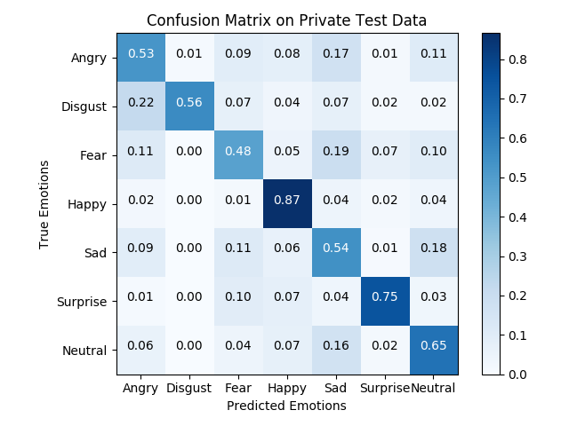
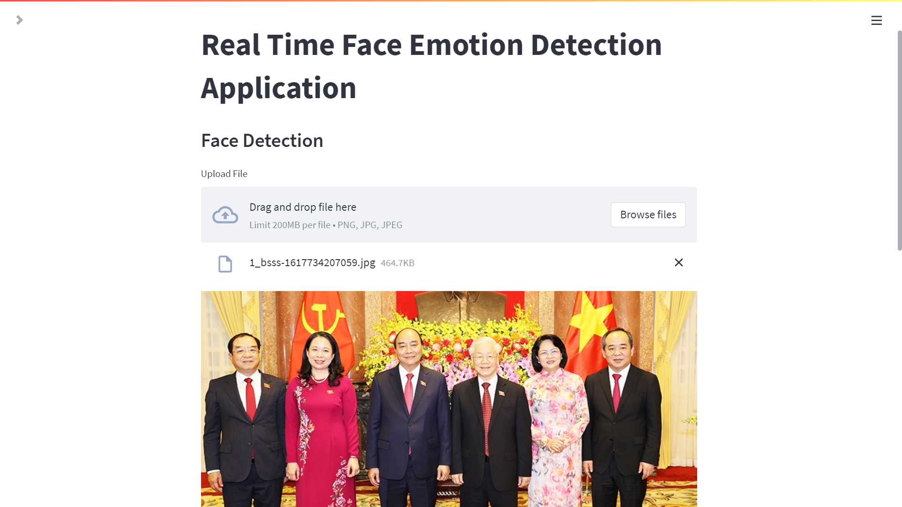
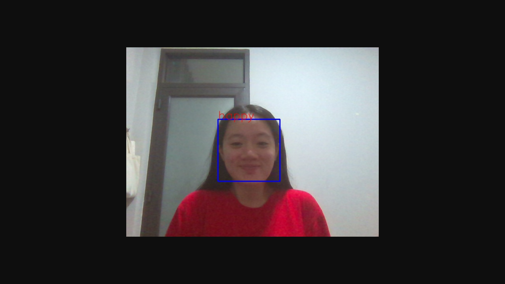
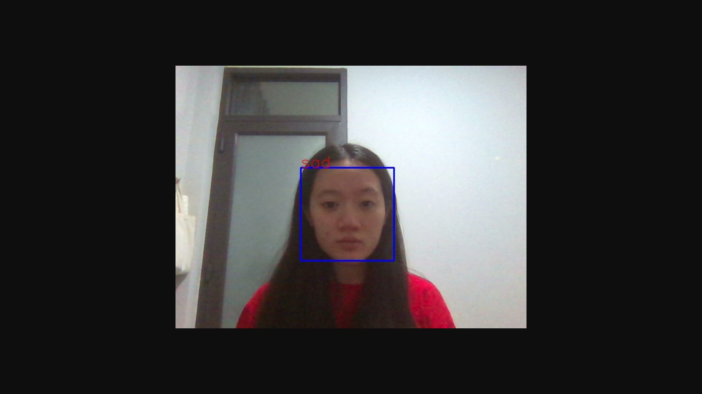

# Lightweight facial expression recognition model

Real-time Human Emotion Recognition From facial expressions. It uses a lightweight  deep Convolutional Neural Network.
The model is highly efficient, and with small size, that can be deployed on devices equipped with limited computational resources.

## Overview

Facial expression recognition (FER) is the task of classifying the expressions on face images into various categories such as anger, fear, surprise, sadness, happiness and so on. FER  is significant for human-computer interaction such as clinical practice and behavioral description.In this work, we propose a lightweight deep learning model based on VGGnet. The model used achieved an accuracy of 72% on the test data. The realtime analyzer assigns a suitable emoji for the current emotion.


## Dataset

Sources for the base datasets

FER Dataset: https://www.kaggle.com/c/challenges-in-representation-learning-facial-expression-recognition-challenge

CK Plus Dataset: https://github.com/WuJie1010/Facial-Expression-Recognition.Pytorch/tree/master/CK%2B48

KDEF Dataset: https://www.kdef.se/download-2/register.html

JAFFE: https://zenodo.org/record/3451524#.YtQ-sXZBzSE

Database Drive : https://drive.google.com/drive/folders/1X1ZBHWFcHxBA1E6Hr4uWV84il6TvH_PE?usp=sharing

## Model 
The model's architecture reference from [FER using VGGnet](https://github.com/usef-kh/fer)

You can see the model's architecture in image below:
:------------------------------------------------------:


## Setup Environment

To use this repo, create a conda environment using environment.yml or requirements.txt

```
# from environment.yml (recommended)
conda env create -f environment.yml

# from requirements.txt
conda create --name <env> --file requirements.txt
```

## Training 

To train your own version of our network, run the following
```
python train.py network=vgg name=my_vgg
```

Losses           |  Accs
:-------------------------:|:-------------------------:
  |  


Confusion Matrix





## Run Webapp

```
streamlit run webapp.py
```





Happy           |  Sad
:-------------------------:|:-------------------------:
  |  


